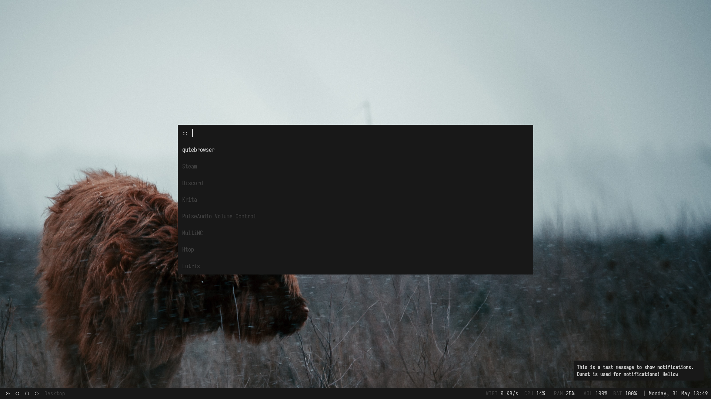
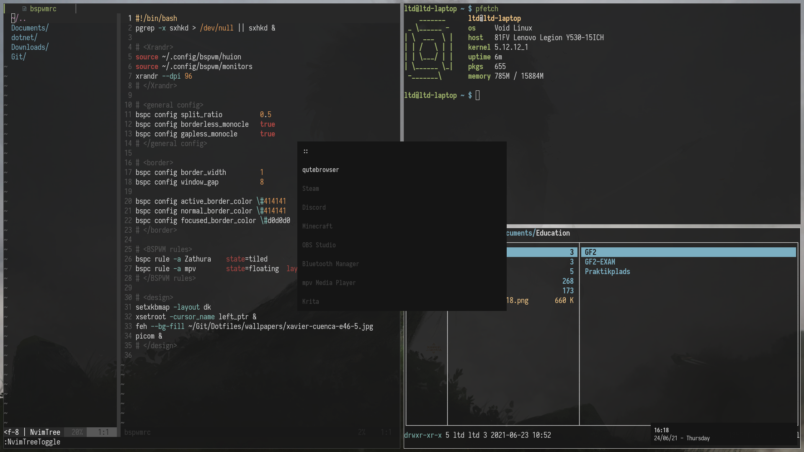

## My minimal BSPWM setup



### Packages used for TWM-setup
* BSPWM - Window Manager
* SXHKD - Keybinds
* Dunst - Notifications
* Alacritty - Terminal Emulator
* Nvim - Editor
* Rofi - Application Launcher
* Htop - Process viewer
* Picom - Compositor
* Polybar - Status Bar
* Ranger - File manager
* Zathura - PDF Reader
* Qutebrowser - Browser
* Opendoas - Replacement for sudo
* Joplin - Note application
* Flameshot - Screenshot tool
* Xorg-xinit - Launch X11 display server
* Xorg-xinput - Graphics tablet input
* Plata-noir-dark - GTK-theme
* Nerd-fonts-iosevka - Font
* Font-awesome5 - Icons
* Pfetch - PC-information
* Feh - Image viewer/wallpaper
* Nm-connection-editor - Network manager GUI
* Picocom - Console program
* TLP - Battery life optimization
* Ly - Display manager
* Pulseaudio - Audio
* Pavucontrol - GUI audio control
* Pulsemixer - Audio control
* Krita - Drawing/photo-editing

### Yay install (for arch)
https://github.com/Jguer/yay

```shell
pacman -S --needed git base-devel
git clone https://aur.archlinux.org/yay.git
cd yay
makepkg -si
```

To work with doas (do this after you install opendoas):
```shell
yay --sudo doas --sudoflags -- --save
```

### One line install
For non-AUR:
```sh
pacman -S xorg-server xorg-xinit xorg-xinput bspwm sxhkd feh git alacritty neovim rofi htop picom ranger zathura zathura-pdf-poppler qutebrowser pulseaudio pavucontrol pulsemixer flameshot dunst picocom nm-connection-editor tlp krita
```

For AUR
```sh
yay -S joplin-desktop plata-theme polybar pfetch-git ly-git opendoas
```

Or Void-Linus XBPS:
```sh
xbps-install xorg bspwm sxhkd feh git font-iosevka alacritty pfetch neovim rofi htop picom ranger pulseaudio pavucontrol pulsemixer zathura zathura-pdf-poppler qutebrowser flameshot dunst picocom tlp opendoas krita
```

### Base16-shell theme (dark-default used)
```sh
git clone https://github.com/chriskempson/base16-shell.git ~/.config/base16-shell
```

Goes in .zshrc:
```sh
# Base16 Shell
BASE16_SHELL="$HOME/.config/base16-shell/"
[ -n "$PS1" ] && \
    [ -s "$BASE16_SHELL/profile_helper.sh" ] && \
        eval "$("$BASE16_SHELL/profile_helper.sh")"
```

Then for default-dark run in a new terminal:
```sh
base16_default-dark
```

### ZSH/oh-my-ZSH addons
Install oh-my-zsh with curl:
```sh
sh -c "$(curl -fsSL https://raw.github.com/ohmyzsh/ohmyzsh/master/tools/install.sh)"
```

Using "gentoo" terminal style

zsh-syntax-highlighting:
```sh
git clone https://github.com/zsh-users/zsh-syntax-highlighting.git ${ZSH_CUSTOM:-~/.oh-my-zsh/custom}/plugins/zsh-syntax-highlighting
```

Fish-like autosuggestions:
```sh
git clone https://github.com/zsh-users/zsh-autosuggestions ${ZSH_CUSTOM:-~/.oh-my-zsh/custom}/plugins/zsh-autosuggestions
```

### Vim-plug
For neovim:
```sh
sh -c 'curl -fLo "${XDG_DATA_HOME:-$HOME/.local/share}"/nvim/site/autoload/plug.vim --create-dirs \
       https://raw.githubusercontent.com/junegunn/vim-plug/master/plug.vim'
```

### Xorg conf
Goes in
```sh
/etc/X11/xorg.conf.d
```
* nvidia-drm-outputclass.conf runs xorg with dedicated nvidia
* touchpad.conf allows tap to click
* 50-mouse-acceleration.conf removes mouse acceleration
