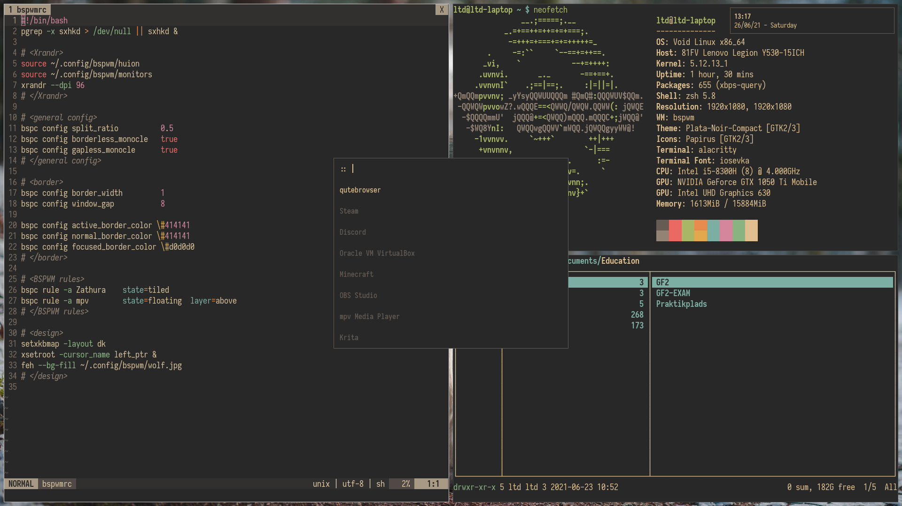

## TWM BSPWM Setup


### Packages used
* BSPWM              - Window Manager
* SXHKD              - Keybinds
* Dunst              - Notifications
* Alacritty          - Terminal Emulator
* Nvim               - Editor
* Rofi               - Application Launcher
* Htop               - Process viewer
* Ranger             - File manager
* Zathura            - PDF Reader
* Qutebrowser        - Browser
* Flameshot          - Screenshot tool
* Xorg	             - Xserver
* Plata-theme        - GTK-theme
* Papirus-icon-theme - Icon theme
* Nerd-fonts         - Font
* Feh                - Image viewer/wallpaper
* Pulseaudio         - Audio
* Pulsemixer         - Audio control
* Krita              - Drawing/photo-editing
* ACPI               - Battery information

### Install script
For automated install use the install-script.It is not required to clone the repo for it to function, it will clone the repo itself.

### Vim-plug
For neovim:
```sh
sh -c 'curl -fLo "${XDG_DATA_HOME:-$HOME/.local/share}"/nvim/site/autoload/plug.vim --create-dirs \
       https://raw.githubusercontent.com/junegunn/vim-plug/master/plug.vim'
```

### ZSH/oh-my-ZSH addons
Install oh-my-zsh with curl:
```sh
sh -c "$(curl -fsSL https://raw.github.com/ohmyzsh/ohmyzsh/master/tools/install.sh)"
```

zsh-syntax-highlighting:
```sh
git clone https://github.com/zsh-users/zsh-syntax-highlighting.git ${ZSH_CUSTOM:-~/.oh-my-zsh/custom}/plugins/zsh-syntax-highlighting
```

Fish-like autosuggestions:
```sh
git clone https://github.com/zsh-users/zsh-autosuggestions ${ZSH_CUSTOM:-~/.oh-my-zsh/custom}/plugins/zsh-autosuggestions
```

